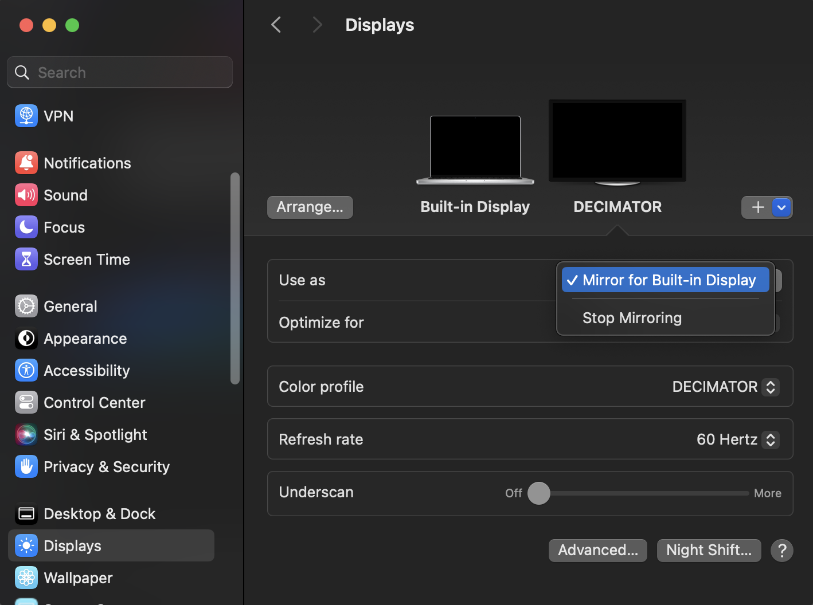
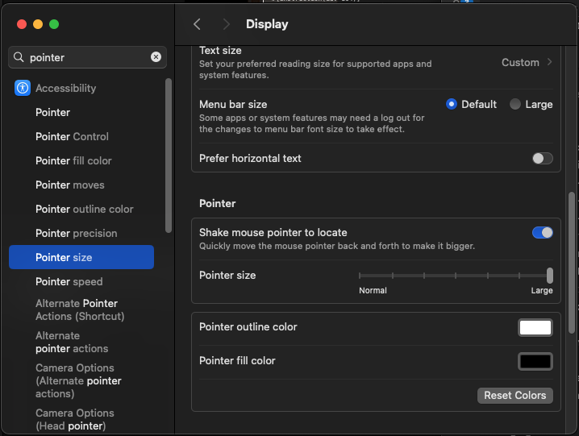

## Event planning playbook

**Roles**:

​ 1 x Instructor and event-responsible individual

​ 1 x Onsite coordinator (student greeting, student wrangling, catering, building access, equipment installation)

​ 1 x Marketing (promotion to external teams)

### Beginning of lead time (see above)

#### Have secured budget

None of this goes ahead unless there’s a budget

​ Costs will be equipment, event space, catering, and merch, see below.

#### Have secured date, venue, and equipment

The venue needs to be quiet (ie not in the middle of a loud event like a Hacker House)

Confirm seating arrangements:

- Desks and chairs facing the instructor
- Projectors or equivalents
  - Multiple 90-inch monitor/TVs (one closer to back) as projector equivalents.
  - Actual projectors are generally preferable to monitors as the text size is larger.

Ideal but not essential: the presenter has two laptops - one for Keynote, the other for their own use during class. Eg, while the students code from a display, the instructor can look up documentation in answer to specific student requests.

#### Luma page up

Create the Luma page by following these steps:

##### Description

From a previous event, update accordingly based on your organization and location!

> ​​The Solana Foundation is inviting developers to a 4-day Solana professional training session.

> The training covers cryptography fundamentals, blockchain, and Solana from the ground up, with frequent hands-on labs. By the end of the bootcamp, attendees will be able to create and transfer tokens, mint NFTs, and build on-chain applications on Solana, the fastest, cheapest, and most scalable blockchain.
>
> The training is aimed at any existing web developer. You'll need to know TypeScript, but you don't need prior cryptography or blockchain experience.
>
> This training is free of charge.
>
> Lunch is provided daily.
>
> Requirements:
>
> - Proficient in TypeScript
> - This is a hands on course, so you'll need a laptop. A Mac or Linux laptop, Windows is fine too but you must have WSL2 and Microsoft Terminal installed.

> We're expecting a large demand for this course, so we've added a few questions during registration. Registering does not guarantee acceptance into the training. If you're accepted we'll see you there!

See previous events: [May 28, 2023](https://lu.ma/850szocc), [Mar 25, 2023](https://lu.ma/ah0v9gwb)

#### Options

Tickets: free

Require Approval: yes

Capacity: 3x attendees (eg, if you want 15 people, limit the event to 45 people) due to flakiness

#### ⚠️ Before you publicize the event

**Note**: it will be too late to change these after you get sign-ups so please do all of these **immediately after makiing the event**.

- In 'Overview', click 'Edit Event', scroll all the way down, and set 'Restrict Location to Guests' (this stops unregistered guests from showing up)
- Click 'Registration' and add a checkbox question:
  - 'I can commit to all 4 days of training, 10 AM to 4 PM'
  - 'I have a laptop running macOS, Linux, or Windows (Windows must have WSL2 and Microsoft Terminal)'
- Click 'More', 'Event page', and set a nice slug in the Public URL `solana-training-nyc-may-28-2024`. Note: you **must** do this before publicizing your event, as Luma will **not** redirect from the old URL to the new URL if you have it, which will break any links to the original URL.

#### Begin Promotion:

- X/Twitter
  - This should be an ongoing promotion, sent from your own account. Use emojis and get retweets from major ecosystem accounts
- Marketing will help

  - [Offline](https://twitter.com/getofflinexyz) (formerly Solana NYC Alliance)
  - [Solana U](https://www.solanau.org/)
  - [NY Tech Alliance](https://www.nytech.org/)
  - NY [Baddies in Tech](https://www.baddiesintech.com/)
  - NYU Computer Science
  - Other Blockchain groups
  - Local community groups

- Paid ads possibly, but we didn't last time.
  - A good strategy with paid engagement is to try a few organic posts and use paid engagement as a force multiplier for the posts that organically get popular. Eg, try five pieces of content, pick the one that performs the best after 24 hours, and put a budget behind it for paid engagement.
  - Target the geographic area for the class
  - Target accounts that follow general JS/TS developers, rather than accounts that follow blockchain accounts.

#### Equipment

Tables, chairs, monitors/projectors, clicker:

Screens and keyboard/mice are not needed as students bring their laptops

Confirm room layout, eg:

2 developers fit on a standard (30x72) table. You can physically fit three, but it won't be comfortable. Use two.

```plaintext
Instructor + TV

[ table ]   [ table ]
[ table ]   [ table ]
[ table ]   [ table ]
```

### 2 weeks

#### Merch / Swag

Your contact at Solana Foundation may be able to organize items from https://store.solana.com/

#### Manual confirmation and setup reminder email

The purpose of this email is twofold:

- Confirm attendance - the people who reply to this email are your real attendees.
- Ensure nobody spends the first day configuring their laptops

Luma allows you to contact attendees, but we won’t use that for this email - you’ll get a better response rate with a **personal** email that doesn’t look like spam.

Send from personal account:

---

To: your email address

CC: **nobody** (important, don’t put anyone here as it will reveal ('dox') attendees to each other)

BCC: attendee list

Subject: Action Required: confirm attendance for Solana professional training next week

Body (modify accordingly):

We are pleased to inform you we have accepted you to the Solana professional training event in our offices next week!

Here are the details:

⏰ When: Monday March 25 - Wednesday March 27

📍 Where: (address including floor and any entrance instructions - and fix the Google Maps link!)

Google Maps link: [https://maps.google.com]

🤓 What: The training will cover the basics of cryptography, blockchain, and Solana from the ground up, with frequent hands-on labs. By the end of the training, you will be able to create and transfer tokens, mint NFTs, and build on-chain applications.

☝️ Requirements:

- You’ll need to be proficient in TypeScript. For example, you should understand what `Promise<Array<Item>>` means.

- A laptop running macOS, Linux, or Windows.

  - Windows must have WSL2 and Microsoft Terminal installed and running before the event.

- Please have nodejs 18 or 20 installed before the event

- FOR CLASSROOM TRAINING ONLY (ZOOM HAS ZOOM CHAT) Please have Telegram messenger on your laptop - we’re going to be interacting with each other on devnet and be using this to send wallet addresses around!

You don't need to know Rust, and no previous experience in cryptography or blockchain is needed.

🥗 Food: Lunch is provided daily. Coffee, drinks, and snacks are available daily.

🚨 Action: Please respond to this email if you plan on attending.🚨

We look forward to hearing from you and congratulations on your acceptance!

(your regular email signature)

---

### 3 or so days before

Collect the email addresses that replied to the ‘action required’ email and send them to your building security so attendees can access your building.

### Day before event

#### Room setup

The day of the event it’s unlikely you will have time for room setup. Students will arrive before the event and want to talk to you.

- Chairs
- Desks
- Power strips
- TV/projector
- Whiteboard, eraser, markers.

#### Telegram Group

Make a Telegram Group for the classroom.

### Morning of event

- **You will have little or no time in the hour before the event.** Someone will inevitably arrive early. Don’t leave anything to the last minute if you can.
- Onsite coordinator: as people arrive, greet them and let them know about breakfast
- Write the wifi name on the whiteboard - people will arrive late, let them know the Wifi password. Don’t use a slide for this, or you’ll forever be jumping back and forth to the slide with the WiFi details.

### Delivering content remotely

Keep in mind that when delivering content remotely, distraction is only a tab away.

Use big gestures, vary your tone, and tempo, and joke around, more so than you would in person.

### Training days

In order to put macOS into a mode where:

- Keynote shows the current slide, plus instructor notes, and the next slide
- The TV shows the current slide

#### Display Settings for Projector Use

You need to set display settings on your Mac. **This is not as obvious as it sounds.**

- Pick the TV and set **Use As** to **Stop Mirroring**. Yes that doesn’t make any grammatical sense.
- You can now extend the display onto the TV.

****

#### Mouse Pointer Settings

It's also advantageous to use large mouse cursors when presenting (to stop 'losing' your mouse between the projector and your own screen):

****

#### Common causes of students having trouble with the labs:

The instructor notes have guides for specific lessons, but watch out for:

- Students with an out-of-date node.js. There’s a node version check in the slides for this reason. Anything less than node 18 was at the time of writing unsupported by node.js maintainers. Running an out-of-date version will give you errors about strange characters like (`||=`) when reading files.
- Students inconsistently moving between spellings of ‘favorites’ / ‘favourites’ during the Anchor lab.
- Editors other than VScode are fine, but you can use your own VScode / Rust Analyzer setup to work out why the code doesn’t work. Rust Analyzer _will_ make catching bugs easier.
- If you’re stuck about why a student’s code doesn’t work you can also commit their work, paste the correct answer from the `labs` folder and look at the differences in your git client.
- If you don’t know the answer to a question, that’s OK, tell the student you’ll chase an answer, and ask your colleagues on Slack.

### Final day

Chase up any items the students have added to the 'to be addressed’ list

Ensure people know of:

- Solana Stack Exchange
- 'Program Examples' repo for Anchor

Essentially you want to make sure they're part of the wider Solana developer community and don't use the class Telegram for technical support!

**If people do ask technical questions on Telegram** direct them to Solana Stack Exchange.

Check for any lost property

Return extra merch/swag to the storage area.

### After the Event

- Check [survey results on the TypeForm](https://admin.typeform.com/form/IPH0UGz7/results#responses)
- Correct any bugs in the course material and or instructor notes

- Send a follow-up email, for example (modify as appropriate):

Send from personal account:

---

To: your email address

CC: **nobody** (important, don’t put anyone here as it will reveal ('dox') attendees to each other)

BCC: attendee list

Subject: Action Required: confirm attendance for Solana professional training next week

Body (modify accordingly):

---

Thanks for joining us at the first Solana Professional Developer Training! 🎉 I learned a lot and I hope you did, too. Here are a few resources to assist on your Solana journey:

🤓 Continue building with:

- [Solana Stack Exchange](https://www.web3builders.dev/) - Q and A. Search before posting!

- [Solana DevRel Program Examples](https://github.com/solana-developers/program-examples) - perpetually updated examples of Anchor Solana programs maintained by the Solana Foundation.

- [Web3 Builders Alliance](https://www.web3builders.dev/) - multiple-week deep Solana development course. WBA graduates have built a lot of Hackathon winners and Solana ecosystem products.

- The [Rareskills EVM to SVM tutorial](https://www.rareskills.io/solana-tutorial) - recommended to folks coming from an EVM background

🗓️ Follow the [Solana Foundation Developer Events calendar](https://solana.com/events) for more opportunities to learn and connect with other developers.

🤝 Know any colleagues that need Solana training? Know any meetup groups in NYC that need Solana speakers? Let us know by replying to this email and we'll get in contact.

📱 Follow [@solana_devs on X](https://x.com/solana_devs) to stay updated with the latest information about the Solana ecosystem.

💼 Check out [Solana Jobs](https://jobs.solana.com/jobs) to get hired.

🏟️ Check out [Colosseum](https://www.colosseum.org/hackathon) to learn about upcoming Hackathons/

📫 If you have any feedback, you are always welcome to share it directly with me!

Cheers,

FILL_IN_YOUR_NAME

---
